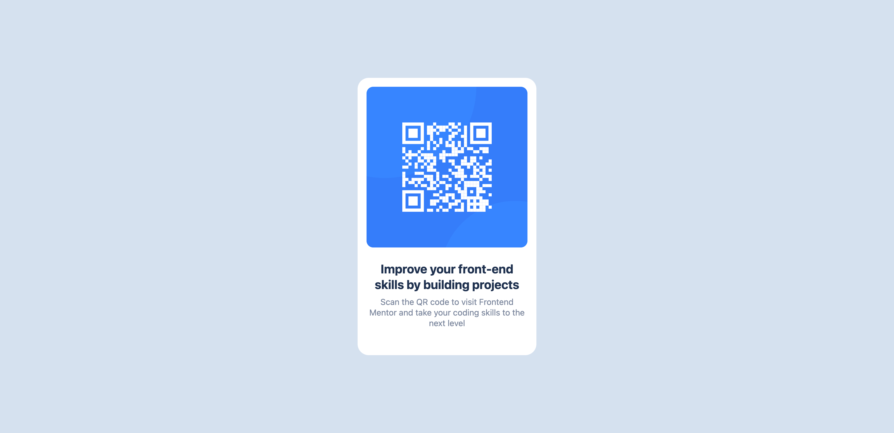
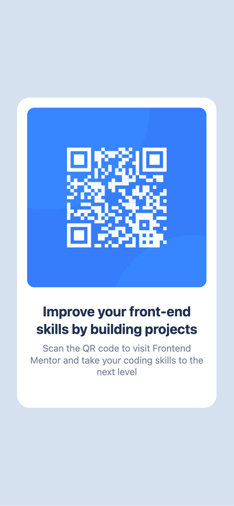

# Frontend Mentor - QR code component solution

This is a solution to the [QR code component challenge on Frontend Mentor](https://www.frontendmentor.io/challenges/qr-code-component-iux_sIO_H). Frontend Mentor challenges help you improve your coding skills by building realistic projects. 

## Table of contents

- [Overview](#overview)
  - [Screenshot](#screenshot)
  - [Links](#links)
- [My process](#my-process)
  - [Built with](#built-with)
  - [What I learned](#what-i-learned)
  - [Continued development](#continued-development)
  - [Useful resources](#useful-resources)
- [Author](#author)
- [Acknowledgments](#acknowledgments)

**Note: Delete this note and update the table of contents based on what sections you keep.**

## Overview

### Screenshot




### Links

- Solution URL: [Add solution URL here](https://your-solution-url.com)
- Live Site URL: [Add live site URL here](https://your-live-site-url.com)

## My process

### Built with

- Semantic HTML5 markup
- Vue
- Tailwind
- Flexbox
- Mobile-first workflow
- [Vue](https://vuejs.org/) - JS library
- [Google Fonts](https://fonts.google.com/)

### What I learned

Use this section to recap over some of your major learnings while working through this project. Writing these out and providing code samples of areas you want to highlight is a great way to reinforce your own knowledge.

To see how you can add code snippets, see below:

I learn how to setup tailwind a use custom metrics and how use it in css code

```html
<h3 class="
  font-sans
  font-bold
  text-navy-dark
  text-[22px]
  leading-7
">Improve your front-end skills by building projects</h3>
<p
  class="
    font-sans
    text-base
    text-grey
    leading-[19px]
    mt-2
  "
>
  Scan the QR code to visit Frontend Mentor and take your coding skills
  to the next level
</p>
```
```css
body {
  @apply bg-grey-light;
}
```
```js
export default {
  content: [
    "./index.html",
    "./src/**/*.{vue,js,ts,jsx,tsx}",
  ],
  theme: {
    extend: {
      colors: {
        blue: "#2C7DFA",
        'blue-shade': "#3685FF",
        'navy-dark': "#1F314F",
        grey: "#7D889E",
        'grey-light': "#D5E1EF",
        white: "#FFFFFF",
      },
      fontSize: {
        base: "15px",
      },
      fontFamily: {
        sans: ["Oufit", ...defaultTheme.fontFamily.sans],
      }
    },
  },
  plugins: [],
};
```
### Useful resources

- [Vue docs](https://vuejs.org/guide/introduction.html).
- [Vite docs](https://vitejs.dev/guide/assets.html) - Here I learned how to use assets with vite.

## Author

- Frontend Mentor - [@savaf](https://www.frontendmentor.io/profile/savaf)
- Twitter - [@savafjs](https://www.twitter.com/savafjs)
- Twitch - [@savafjs](https://www.twitch.tv/savafjs)
